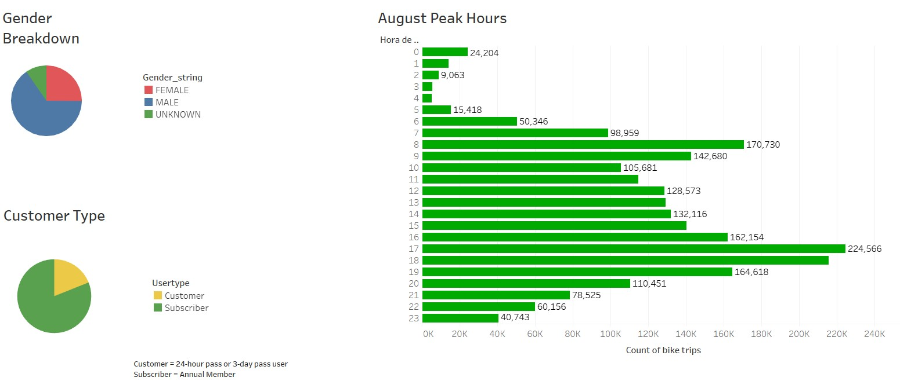
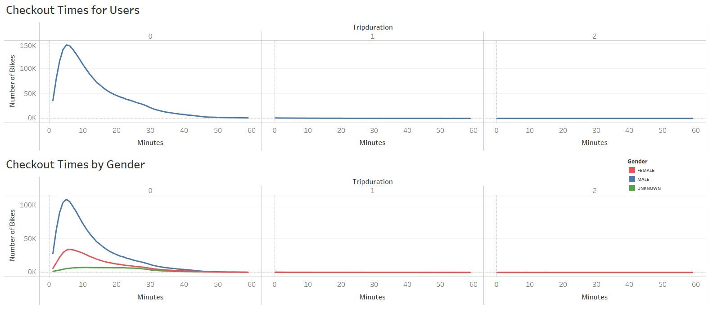
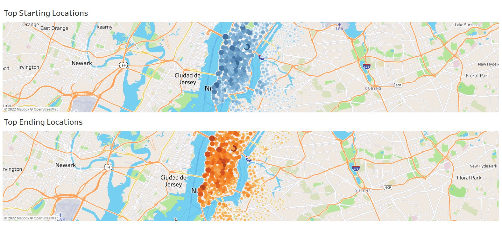
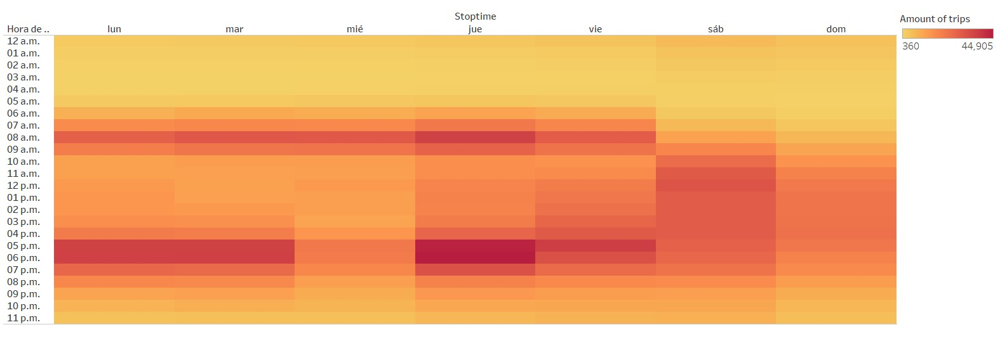
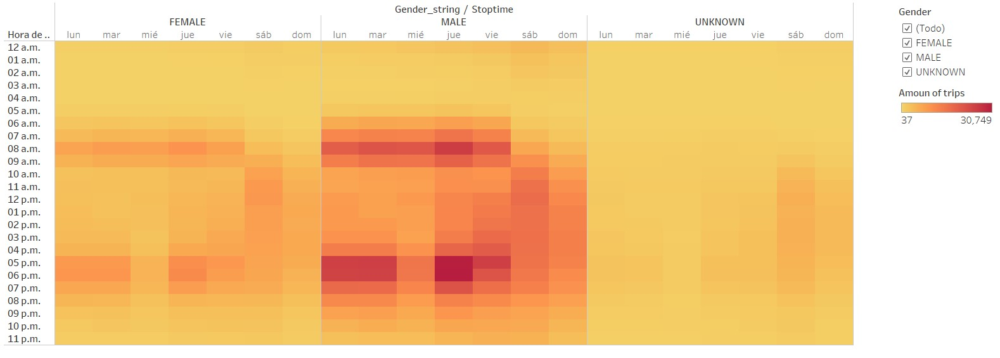
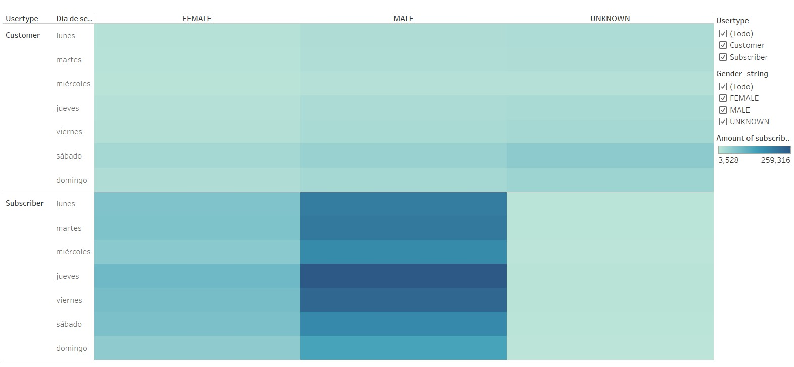
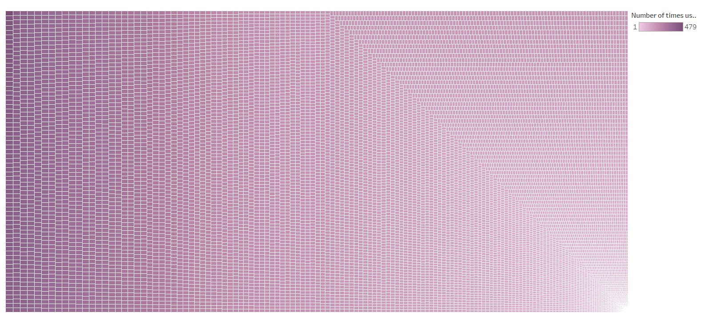

# Analyzing citibike data in New York using Tableau

## Overview 

CitiBike is a bike sharing program with 25,000 bikes and over a 1,500 statios over Manhattan, Brooklyn, Queens, The Bronx, Jersey City and Hoboken. 
We want to attract potential investors for "DM Bike", which is the same concept as citiBike but implemented in Des Moines, Iowa.  
First we will study the information about citibike to know its behavior and then study the possibility to implement it in Iowa.

## Results

### Type of customers and Peak hours

The information shows that most of the customer type are subscribers and males, who use the most the service.  The bar graph shows that peak hours where bikes are most used coincide with working hours.

### Checkout time for users

Regarding the time of a trip, most of the trips are around 5 minutes and we see that the number of trips begins to decrease with very few trips longer than 50 minutes. We can also see that the main bike users are males.

### Top start and ending locations

From the maps we can see that strarting and ending locations have the same tendency. 
We can also see that both locations are close to tourist places such as the Grand Central Terminal, Madison Square, Broadway, Garden, Union Square, Madison Square, Central Park, among others. 

### Top hours from weekdays and Top hours from weekdays by gender.

From the graph we can see that the peak hours for usage of the bikes are from workdays around 7 to 9 am and then the usage decreases. A few hours later it increases again around 4 to 7 pm and then decrease after these hours. 
On weekends we can see a different behaviour presenting a high and partially constant usage
of bike from 9 am to 6 pm and then decreasing after these hours. Saturday has the most usage of bikes rather
than Sunday but both present the same behaviour.

When we segment the graph by gender, we can see that males use more the bikes than females.

### Days of the week with most checkouts by user and gender

This graph shows that subscribers tends to use the bikes more during the whole week and being males the main users.
We can see also see that customers tends to use the bikes more on weekends, being satuday the bussiest day.

### Bike usage and bike repair

This visualization shows at the top-left the most used bycicle while at the bottom-right the less used one. 

## Summary

* A hyphotesis could be that most of users could be residents of New York who work and use the service to commute to work, this could be supported by the fact of having peak hours of usage around working hours and that most of users are subscribers.

* Bike repairs/maintenance could be suggested on working days around 1 to 5 am, on weekends around 1 to 6 am or at late hours, (past 8 pm) the whole week.

* In the maps shown above, the top starting and ending locations are displayed in darker color, but the map also displays mid color marks around New York and these marks could be strategic places for users to commute to work. A 
further analysis of adding up all the mid color marks and compare them to the addition of darker ones would help to understand this information better.

* A poll could be launched to know the purpose of the use of the bike, with options like "commute to work", "recreation", or "sport" among other options and then plot the results to understand more at the users of the service.

